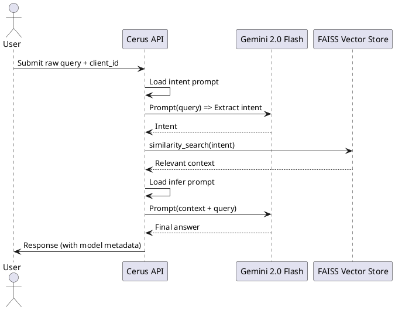

# Cerus: AI-Powered Contextual Inference Engine


## 🚀 Objective
Cerus is an intelligent RAG-based (Retrieval Augmented Generation) API engine designed to:
- Accurately extract **user intent** from natural language queries
- Retrieve **domain-specific context** from vectorized documents
- Perform **precise inference** using a frontier LLM (Gemini 2.0) to provide actionable recommendations

It supports multi-tenant prompt customization and is built for extensibility and precision.

---

## 🧐 RAG Architecture and LLM Flow
Cerus implements a **2-phase LLM interaction pipeline** leveraging Retrieval Augmented Generation:

### Phase 1: Intent Extraction
- Uses a custom intent prompt template (per `client_id`) to extract the **user's intent** from the raw query.
- The extracted intent becomes the new search phrase for vector database similarity matching.

### Phase 2: Contextual Inference
- Contextual documents are retrieved from FAISS using the extracted intent.
- A second inference prompt template (also client-specific) combines:
  - The retrieved context
  - The original query
  - Inference instruction
- A call to Gemini 2.0 Flash is made to **generate precise, context-grounded output**.

Both prompts are configurable and tailored per client, allowing domain-specific tuning.

---

## 🎓 Fine-Tuning Through Prompt Engineering
Cerus does not retrain or fine-tune the base LLM but uses **prompt engineering** with Gemini 2.0:
- **Intent prompts** are optimized to classify the raw query into predefined categories (e.g., "general query", "status").
- **Inference prompts** emphasize clear, concise responses using only the context provided.

Templates:
```text
# intent_prompt (example)
You are an intelligent assistant. Identify the user's intent. Choose one of: general query, status, offer inquiry, rate query, document request.
Query: {user_query}

# infer_prompt (example)
Provide a concise answer to the user's question based strictly on the context provided. Avoid referring to documents. Do not hallucinate.
```

---

## 🔄 Flow Overview




---

## 🚫 Hallucination Mitigation
- The inference prompt **instructs the model** to respond only from context
- Removed phrases like "the document says" or speculative outputs
- OCR and multi-format loaders are used to extract **accurate embeddings** for PDFs, TXT, and PNG (with Tesseract)

---

## ⚙️ Tech Stack
- **FastAPI** backend
- **ReactJS** admin dashboard (template uploads)
- **FAISS** vector database
- **Gemini 2.0 Flash** (via Google GenAI API)
- **LangChain**, **PIL**, **pytesseract**, **dotenv**, **Material UI**

---

## 📊 Sample Output
```json
{
  "client_id": "client_abc",
  "query": "What interest rate applies to my savings?",
  "response": "The savings account offers a variable interest rate based on your balance. For current rates, visit bankofamerica.com or call customer support.",
  "model-type": "RAG",
  "model-ver": "Cerus v1.0"
}
```

---

## 🚪 Admin Features
- Upload separate `intent` and `infer` templates
- Set per `client_id`
- Secure save via `/savetemplate`

---

## 🚀 Coming Soon
- Streamed token output
- Auto-evaluation of intent accuracy
- Client-level performance analytics


# Cerus v0.1

A FastAPI-based LLM recommendation engine using LangChain, FAISS, Google LLM, and React-based admin UI.

## Features

- RAG-based inference using LangChain
- Per-client prompt templates
- Vector indexing of PDFs/text
- Admin UI to upload prompt templates
- FastAPI backend with Swagger
- Dockerized for prod

## Run Locally

```bash
cd backend
python3 -m venv venv
source venv/bin/activate
pip install -r requirements.txt
uvicorn app.main:app --reload
```

## Frontend

```bash
cd frontend
npm install
npm run dev
```

## Docker

```bash
docker-compose up --build
```
